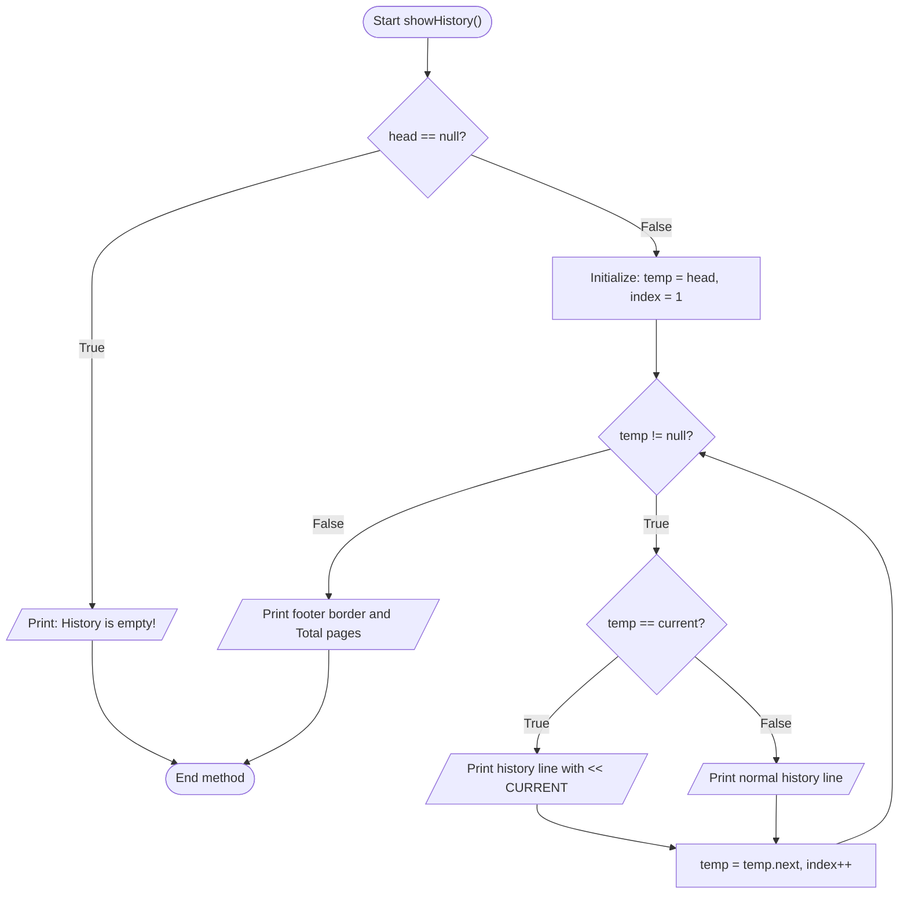

```mermaid
flowchart TD
    Start(["Start showHistory()"]) --> CheckEmpty{"head == null?"}
    
    CheckEmpty -->|True| PrintEmpty[/"Print: History is empty!"/]
    PrintEmpty --> End(["End method"])
    
    CheckEmpty -->|False| InitLoop["Initialize: temp = head, index = 1"]
    InitLoop --> LoopCondition{"temp != null?"}
    
    LoopCondition -->|True| CheckCurrent{"temp == current?"}
    
    CheckCurrent -->|True| PrintCurrent[/"Print history line with << CURRENT"/]
    CheckCurrent -->|False| PrintNormal[/"Print normal history line"/]
    
    PrintCurrent --> NextNode["temp = temp.next, index++"]
    PrintNormal --> NextNode
    
    NextNode --> LoopCondition
    
    LoopCondition -->|False| PrintFooter[/"Print footer border and Total pages"/]
    PrintFooter --> End
```
