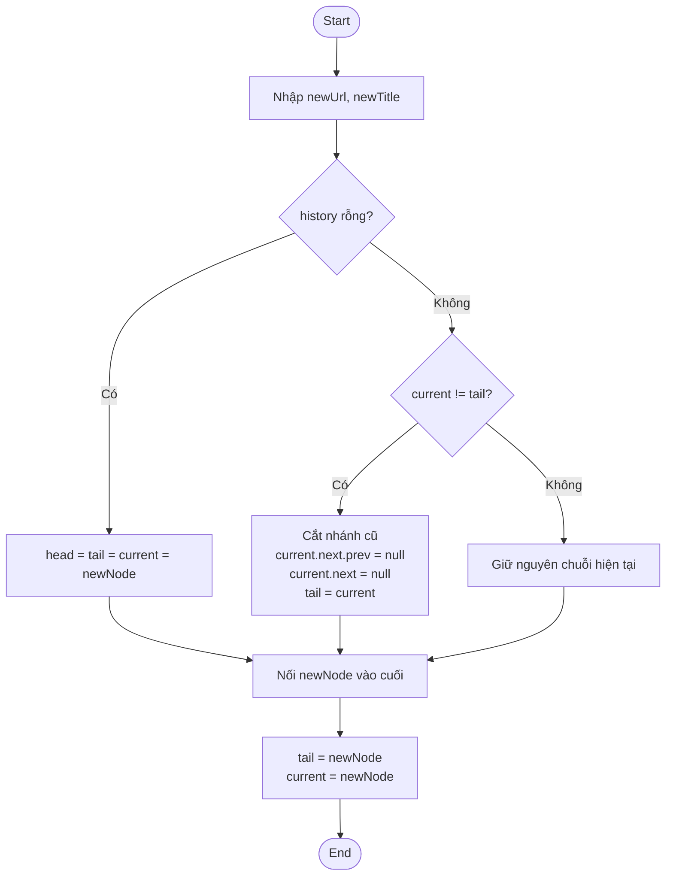

Đào Cao Duy: Thuật toán Thêm mới & Rẽ nhánh (Visit & Branching)

Flowchart



Code triển khai visit()

```java
private int forwardCount;

public void visit(String url, String title) {
    Node newNode = new Node(url, title);

    if (head == null) {
        head = tail = current = newNode;
        size = 1;
        forwardCount = 0;
        return;
    }

    if (current != tail) {
        truncateForward();
    }

    tail.next = newNode;
    newNode.prev = tail;
    tail = newNode;
    current = newNode;
    size++;
    forwardCount = 0;
}

private void truncateForward() {
    if (current.next == null) {
        return;
    }

    current.next.prev = null;
    current.next = null;
    tail = current;
    size -= forwardCount;
    forwardCount = 0;
}
```

AI Reflection

AI thường gợi ý xóa từng node phía sau bằng vòng lặp, nhưng không cần. Chỉ cần cắt `current.next = null`, ngắt luôn `current.next.prev = null`, rồi cập nhật `tail = current` là đủ để tách nhánh cũ ở chi phí $O(1)$; phần node không còn tham chiếu sẽ được Java tự giải phóng.